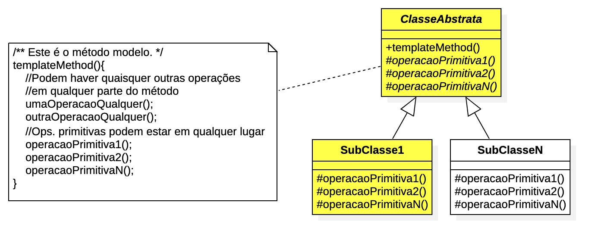

= Modelagem do Padrão Template Method (link:https://kinolien.github.io/gitzip/?download=/manoelcampos/padroes-projetos/tree/master/comportamentais/02-template-method/modelagem/[zip])

Apresenta um código de exemplo da modelagem do padrão Template Method.
Tal código serve apenas de base para implementação de uma solução específica utilizando o padrão.
Assim, nomes de classes, métodos e atributos precisam ser alterados para nomes específicos.

