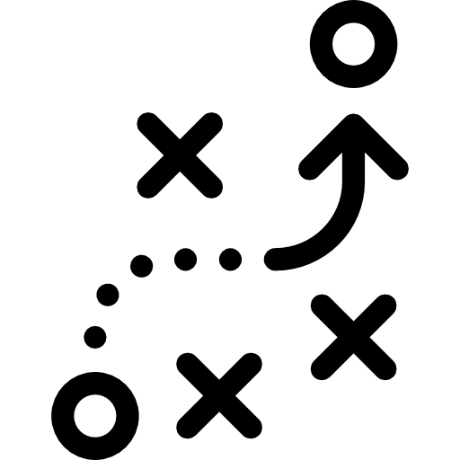
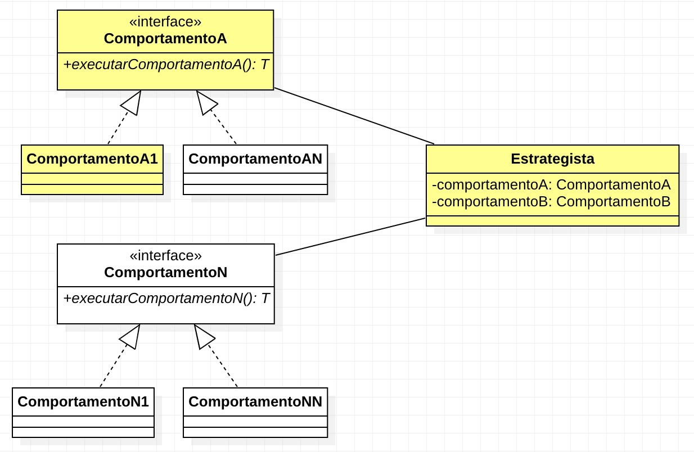
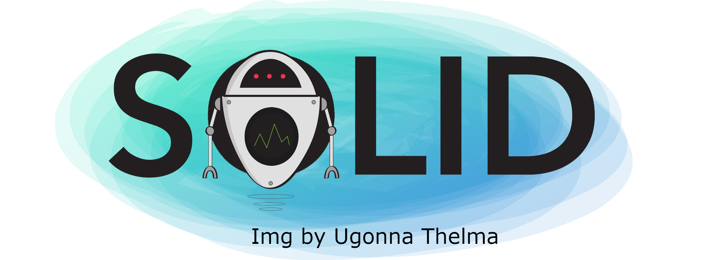
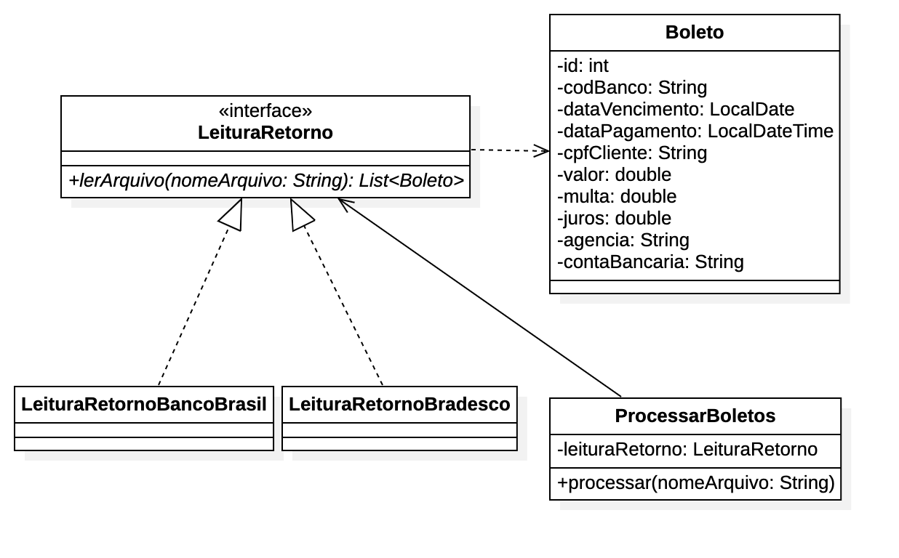

:revealjsdir: https://cdnjs.cloudflare.com/ajax/libs/reveal.js/3.8.0/
//:revealjsdir: https://cdnjs.com/libraries/reveal.js/3.8.0
:revealjs_slideNumber: true
:source-highlighter: highlightjs
:icons: font
:allow-uri-read:
:stylesheet: ../../adoc-golo.css
:customcss: ../../slides-base.css
:numbered:
:toc: left
:toc-title: Sumário
:toclevels: 5

ifdef::env-github[]
//Exibe ícones para os blocos como NOTE e IMPORTANT no GitHub

:caution-caption: :fire:
:important-caption: :exclamation:
:note-caption: :paperclip:
:tip-caption: :bulb:
:warning-caption: :warning:
endif::[]

:chapter-label:
:listing-caption: Listagem
:figure-caption: Figura

//Transição para todos os slides // none/fade/slide/convex/concave/zoom
//:revealjs_transition: 'zoom'

//https://github.com/hakimel/reveal.js#theming
:revealjs_theme: league

= Padrão de Projetos Strategy 

Prof. Manoel Campos https://about.me/manoelcampos

[transition=zoom]
== Categoria

Padrão de projeto Comportamental image:../../images/behaviour.gif[]

[transition=fade]
== Definição

include::README.adoc[tag=definicao]

image:../../images/ucpp.jpg[size=contain]

[transition=zoofadem]
== Aplicabilidade

[%step]
include::README.adoc[tag=aplicabilidade]

[transition=zoom]
== Modelagem do Strategy

image::images/diagram.png[background, size=contain]

== !

[transition=zoom, background-opacity=0.4]
== Princípios utilizados

image::../../images/recommendations.jpg[background, size=contain, text=https://www.smart-energy.com, link=https://www.smart-energy.com/industry-sectors/smart-energy/five-key-recommendations-for-the-sustainable-energy-sector-growth-in-mena/]

== Princípios utilizados

[%step]
- Favorecer composição no lugar de herança
- Baixa acoplamento
- Programar para uma "interface" não uma implementação] (GoF)

== !

== !

[%step]
- **S**_ingle Responsitiliby Principle_ (SRP)
- **O**_pen/Closed Principle_ (OCP)
- **L**_iskov Substitution Principle_ (LSP)
- **I**_nterface Segregation Principle_ (ISP)
- **D**_ependency Inversion Principle_ (DIP)

== Princípios SOLID utilizados

[%step]
- Single Responsibility Principle (SRP)
- Open/Closed Principle (OCP)
- Liskov Substitution Principle (LSP)
- Interface Segregation Principle (ISP)

[transition=zoom]
== Exemplo

- Leitura de arquivos de retorno de boletos bancários.

== !

include::README.adoc[tag=campos-boleto1]

== !

[start=3]
include::README.adoc[tag=campos-boleto2]

[transition=zoom]
== Diagrama Retorno Boleto Strategy

== !

[transition=fade]
== Referências

- “Padrões de Projeto: Soluções reutilizáveis de software orientado a objetos”. Erich Gamma, Richard Helm, Ralph Johnson, John Vlissides [GoF].
- “Use a Cabeça! Padrões de Projetos”. Eric Freeman & Elisabeth Freeman [UCPP].
- “Agile software development principles, patterns, and practices”, Robert Martin, 2011. [ASDPPP]
- https://medium.com/@brunobandev/os-princ%C3%ADpios-s-o-l-i-d-em-imagens-1b5233479c21[Os princípios S.O.L.I.D em imagens]
- https://doi.org/10.1145/197320.197383[Liskov, B H. A behavioral notion of subtyping (1994).]
