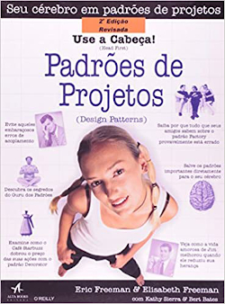
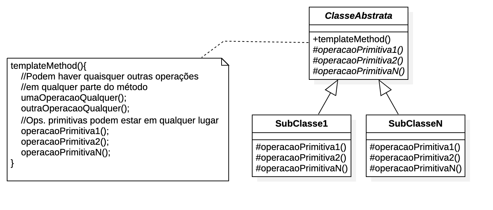
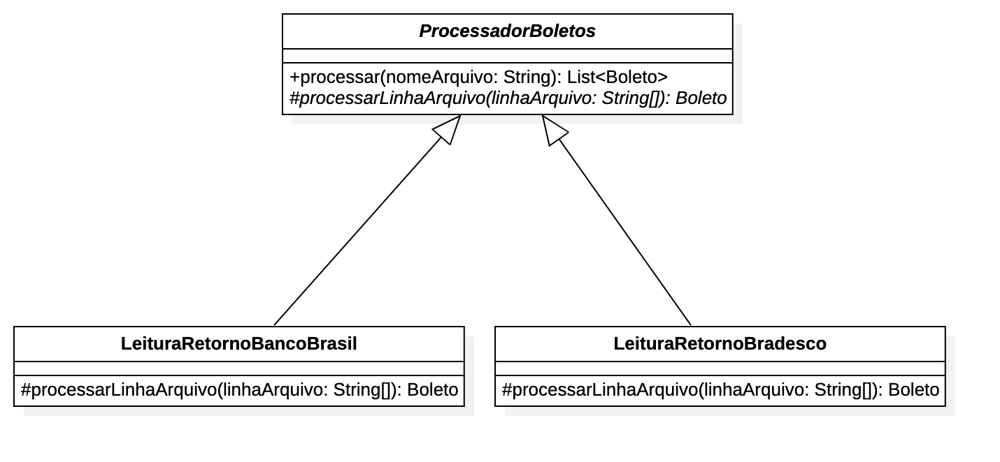
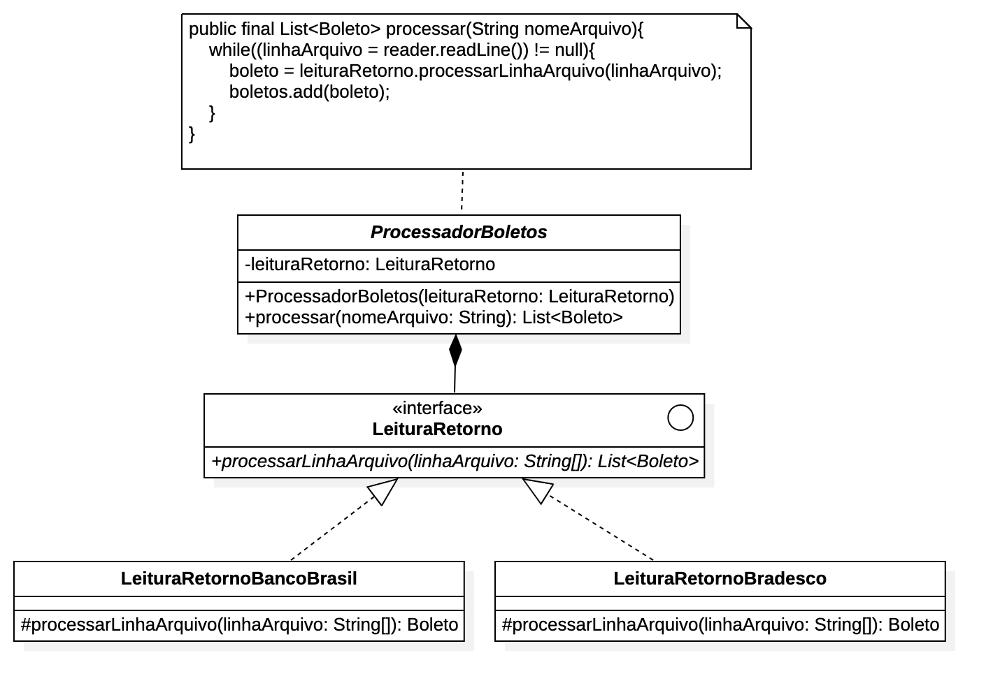
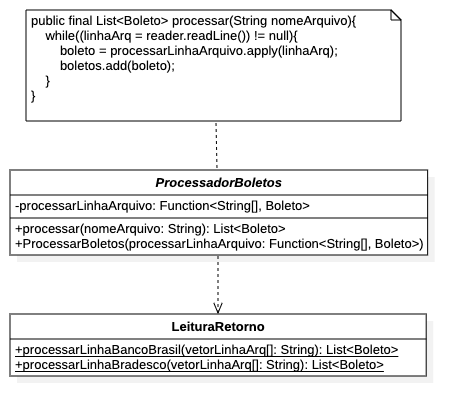

:revealjsdir: https://cdnjs.cloudflare.com/ajax/libs/reveal.js/3.8.0/
//:revealjsdir: https://cdnjs.com/libraries/reveal.js/3.8.0
:revealjs_slideNumber: true
:revealjs_navigationMode: linear

:source-highlighter: highlightjs
:icons: font
:allow-uri-read:
:stylesheet: ../../adoc-golo.css
:customcss: ../../slides-base.css
:numbered:
:toc: left
:toc-title: Sumário
:toclevels: 5

:proj-boleto-template: retorno-boleto-template/src/main/java/com/manoelcampos/retornoboleto/
:proj-boleto-strategy: ../strategy/retorno-boleto/src/main/java/com/manoelcampos/retornoboleto/LeituraRetornoBancoBrasil.java
:proj-boleto-template-strategy: retorno-boleto-template-and-strategy/src/main/java/com/manoelcampos/retornoboleto/
:proj-boleto-funcional: retorno-boleto-template-funcional/src/main/java/com/manoelcampos/retornoboleto/

ifdef::env-github[]
//Exibe ícones para os blocos como NOTE e IMPORTANT no GitHub

:caution-caption: :fire:
:important-caption: :exclamation:
:note-caption: :paperclip:
:tip-caption: :bulb:
:warning-caption: :warning:
endif::[]

:chapter-label:
:listing-caption: Listagem
:figure-caption: Figura

//Transição para todos os slides // none/fade/slide/convex/concave/zoom
//:revealjs_transition: 'zoom'

//https://github.com/hakimel/reveal.js#theming
:revealjs_theme: league

= Padrão de Projetos Template Method : Quase tudo que precisa saber (com exemplos em Java 8+) 🙌🏼

Prof. Manoel Campos https://about.me/manoelcampos

[transition=zoom]
== Categoria

Padrão de projeto Comportamental 

[transition=fade]
== Definição

include::README.adoc[tag=definicao]

[transition=zoofadem]
== Aplicabilidade

Pode ser aplicado quando:

[%step]
include::README.adoc[tag=aplicabilidade]

[transition=zoom]
== Modelagem do Template Method

=== !

[transition=zoom]
== Mas consigo fazer isso apenas com herança e sobrescrita de método 🤨

include::README.adoc[tag=method-override]

[transition=zoom, background-opacity=0.4]
== Princípios utilizados

[%step]
- https://en.wikipedia.org/wiki/Open–closed_principle[Open/Closed Principle (OCP)]
- https://en.wikipedia.org/wiki/Single_responsibility_principle[Single Responsibility Principle (SRP)]

[transition=zoom]
== !

- **Exemplo**: Leitura de arquivos de retorno de boletos bancários, de novo 😅.

== Problema da versão com Strategy

=== !

[source,java,linenums]
----
include::{proj-boleto-strategy}[tag=class-start]
                /* Omitidos campos por simplificação */
include::{proj-boleto-strategy}[tag=class-end]
----

== Modelagem do Retorno Boleto com Template Method

== Implementação do Retorno Boleto com Template Method

=== Super classe com o método Template

[source,java,linenums]
----
include::{proj-boleto-template}/ProcessadorBoletos.java[tag=class-start]
include::{proj-boleto-template}/ProcessadorBoletos.java[tag=template-method]
include::{proj-boleto-template}/ProcessadorBoletos.java[tag=primitive-operation]
include::{proj-boleto-template}/ProcessadorBoletos.java[tag=class-end]
----

=== Sub classe com operações primitivas (1 operação neste caso)

[source,java,linenums]
----
include::{proj-boleto-template}/LeituraRetornoBancoBrasil.java[tag=class-start]
include::{proj-boleto-template}/LeituraRetornoBancoBrasil.java[tag=primitive-operation-start]
        /* Omitidos campos por simplificação */
include::{proj-boleto-template}/LeituraRetornoBancoBrasil.java[tag=primitive-operation-end]
include::{proj-boleto-template}/LeituraRetornoBancoBrasil.java[tag=class-end]
----

=== Usando a implementação do BB 

[source,java,linenums]
----
ProcessadorBoletos processador = new LeituraRetornoBancoBrasil();
String nomeArquivo = "caminho-arquivo-retorno-boleto-banco-brasil.csv";
processador.processar(nomeArquivo);
----

[transition=fade]
== Comparação com o Strategy

[%step]
- Strategy https://en.wikipedia.org/wiki/Composition_over_inheritance[favorece composição no lugar de herança] 👍
- Template Method usa apenas herança: perda da flexibilidade e dinamismo do Strategy 😒
- Mas removeu a duplicação do código e dividiu mais ainda as responsabilidades 🙌🏼

[transition=fade]
== !

**QUE TAL JUNTAR O PODER DOS PADRÕES?**

**Strategy + Template Method**

=== !

=== Implementação do Retorno Boleto com Strategy + Template Method

=== !

[source,java,linenums]
----
include::{proj-boleto-template-strategy}/ProcessadorBoletos.java[tag=class-start]
include::{proj-boleto-template-strategy}/ProcessadorBoletos.java[tag=class-end]
----

=== !

[source,java,linenums]
----
include::{proj-boleto-template-strategy}/LeituraRetornoBancoBrasil.java[tag=class-start]
        /* Omitidos campos por simplificação */
include::{proj-boleto-template-strategy}/LeituraRetornoBancoBrasil.java[tag=class-end]
----

=== Usando a nova implementação com Strategy + Template Method

[source,java,linenums]
----
ProcessadorBoletos processador = 
        new ProcessadorBoletos(new LeituraRetornoBancoBrasil());
String nomeArquivo = "caminho-arquivo-retorno-boleto-banco-brasil.csv";
processador.processar(nomeArquivo);
----

== Modelagem do Template Method com Programação Funcional em Java 8+ 

só isso? 😯

image::images/template-method-funcional.png[]

== Retorno Boleto com Template Method e Programação Funcional em Java 8+

=== !

=== Implementação do Retorno Boleto com Template Method e Programação Funcional em Java 8+

=== !

[source,java,linenums]
----
include::{proj-boleto-funcional}/ProcessadorBoletos.java[tag=class-start]
include::{proj-boleto-funcional}/ProcessadorBoletos.java[tag=class-end]
----

=== !

[source,java,linenums]
----
include::{proj-boleto-funcional}/LeituraRetorno.java[tag=class-start]
include::{proj-boleto-funcional}/LeituraRetorno.java[tag=method-start]
        /* Omitidos campos por simplificação */
include::{proj-boleto-funcional}/LeituraRetorno.java[tag=method-end]
----

=== Usando a implementação Funcional

[source,java,linenums]
----
ProcessadorBoletos processador =
        new ProcessadorBoletos(LeituraRetorno::processarLinhaBancoBrasil);
String nomeArquivo = "caminho-arquivo-retorno-boleto-banco-brasil.csv";
processador.processar(nomeArquivo);
----

== O que houve com o Strategy na implementação Funcional? 

(revendo a modelagem)

=== !

== !

**Referências**

- “Padrões de Projeto: Soluções reutilizáveis de software orientado a objetos”. 2006 [GoF].
- “Use a Cabeça! Padrões de Projetos”, 2008 [UCPP].
- “Agile software development principles, patterns, and practices”, Robert Martin, 2011. [ASDPPP]
- http://refactoring.guru (agora também em Português)
