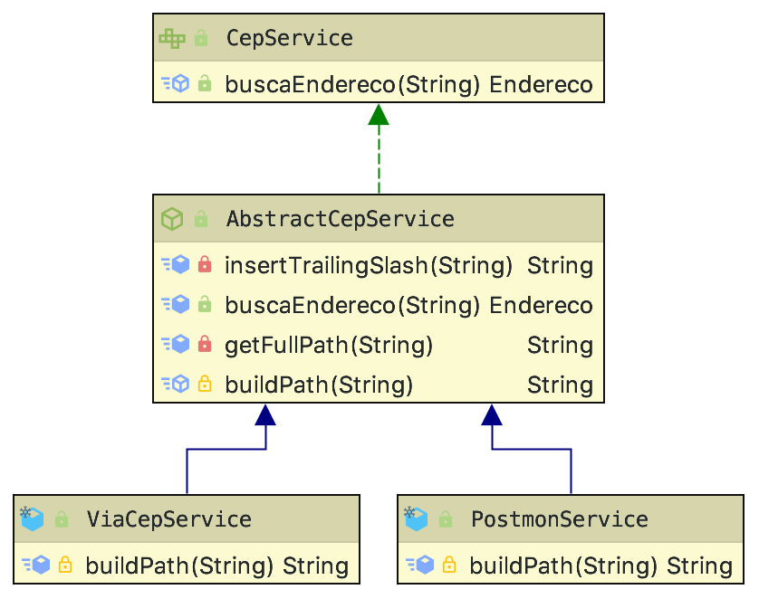

= Consumo de Serviços de CEP com Quarkus

Aplicação de exemplo para consumo de serviço REST de consulta de endereço utilizando o framework http://quarkus.io[Quarkus].
São implementadas as classes ViaCepService e PostmonService para permitir consumir os serviços
https://viacep.com.br[ViaCEP] e https://postmon.com.br[Postmon].

Abaixo é mostrado um exemplo de URI para acesso a tais serviços:

- https://viacep.com.br/ws/77021090/json
- https://api.postmon.com.br/v1/cep/77021090

É utilizada injeção de dependência para definir qual dos dois serviços será utilizado. 
O diagrama de classes a seguir apresenta a modelagem dos projetos:



== Requisitos

- JDK 8 ou 11
- Maven 3.5.3 ou superior

== Executar o Projeto

Você pode iniciar o servidor com sua aplicação de diferentes maneiras:

- Usando o script mvnw incluído durante a criação do projeto: `./mvnw compile quarkus:dev`. O comando deve ser executado na raiz do projeto que rodar.
- Ou simplesmente clicando no botão Play em IDEs como o NetBeans, pois foi incluído o plugin maven exec para executar o comando acima mais facilmente.

==== Atualizando o projeto sem reiniciar o servidor

Bem, atualizar o projeto no servidor em execução e ver as alterações que você fez na sua aplicação é realmente complicado com o Quarkus: você precisa apenas salvar o projeto e boom: normalmente em menos de 1 segundo a aplicação estará rodando com as novas alterações 😱🚀😁.

Não é à toa que o slogan do Quarkus é "Supersonic Subatomic Java".

==== Acessando a aplicação

Se você estiver habituado a usar servidores como o GlassFish no NetBeans,
sabe que ao clicar no botão Play, o projeto é compilado e executado,
abrindo o navegador automaticamente.
Usando o Quarkus isso não ocorrerá.
Você deve abrir o navegador você mesmo. Neste caso, a aplicação estará disponível
em http://localhost:8080.
Observe que não há um caminho adicional com o nome da aplicação no final da URL,
pois a aplicação executa na raiz do servidor.

## Detalhes dos Projetos

Estamos utilizando o framework CDI da plataforma Java para injeção de dependências,
neste caso para injetar implementações do serviço de busca de CEP.
Injeção de dependências é uma técnica que permite instanciar objetos
sem precisar informar, no local onde deseja-se realizar a instanciação, 
qual a classe concreta que será utilizada para isto.

No caso dos serviços de busca de CEP, temos a interface `CepService` e as classes
concretas `ViaCepService` e `PostmonService`. Do modo tradicional, podemos declarar um objeto de forma abstrata como `CepService`, mas no momento de instanciar temos que dizer exatamente qual classe concreta será usada, como:

```java
//Declaração usando tipo abstrato (a interface CepService)
CepService service;
...
...
//Instanciação usando tipo concreto (a subclasse ViaCepService)
service = new ViaCepService();
```

Com o CDI, podemos injetar instâncias de uma classe que implementa `CepService` apenas anotando a variável com `@Inject`, como:

```java
/*Declaração usando tipo abstrato (a interface CepService).
Com a anotação @Inject, um objeto de uma classe concreta 
será instanciado automaticamente quando necessário.*/
@Inject
CepService service;
```

Observe que não temos mais a linha que instancia o objeto. Qual dos dois serviços (`ViaCepService` ou `PostmonService`) será definido de forma centralizada utilizando o CDI. Assim, se precisarmos trocar uma implementação por outra, não temos que sair alterando em todos os locais onde declaramos variáveis do tipo `CepService`.

O CDI funciona por padrão em qualquer projeto web que utilize um servidor de aplicação
como Payara, GlassFish, WildFly e outros, sem exigir esforços de configuração.

## Código Fonte

Existem duas versões deste projeto disponíveis em link:cep-service-default[cep-service-default] e link:cep-service-producer[cep-service-producer]. 
Veja a documentação deles para mais detalhes.
